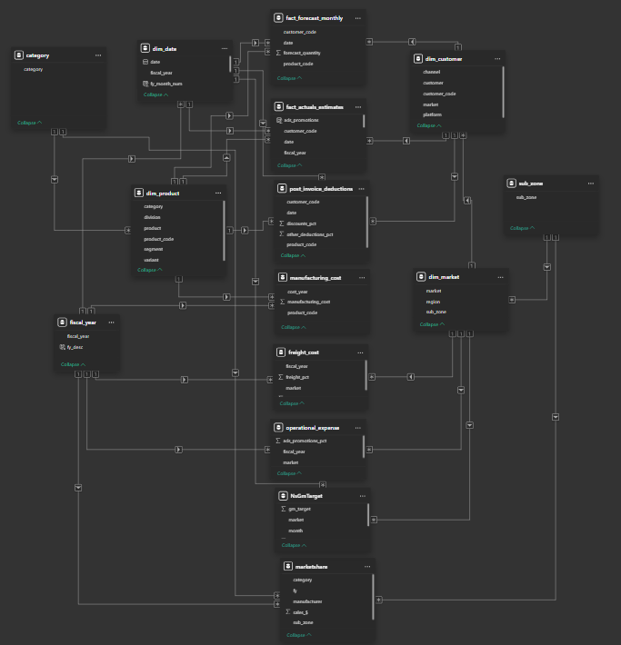
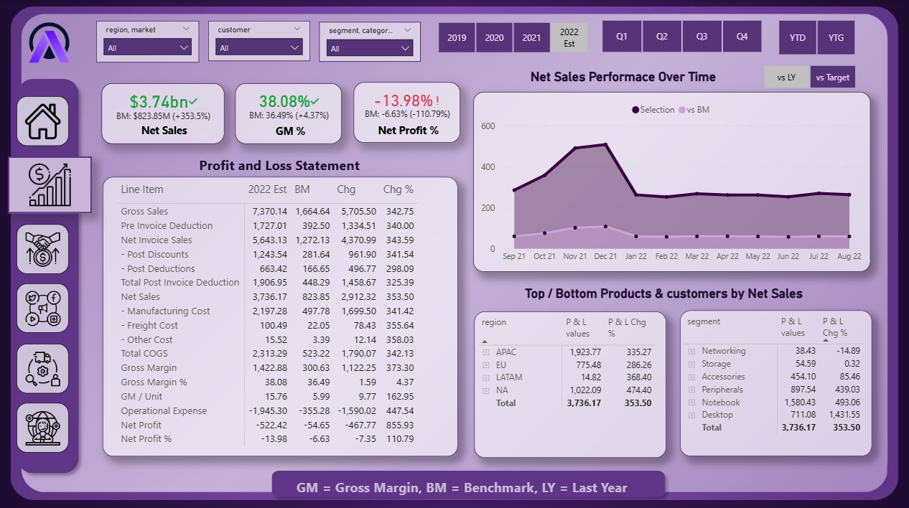
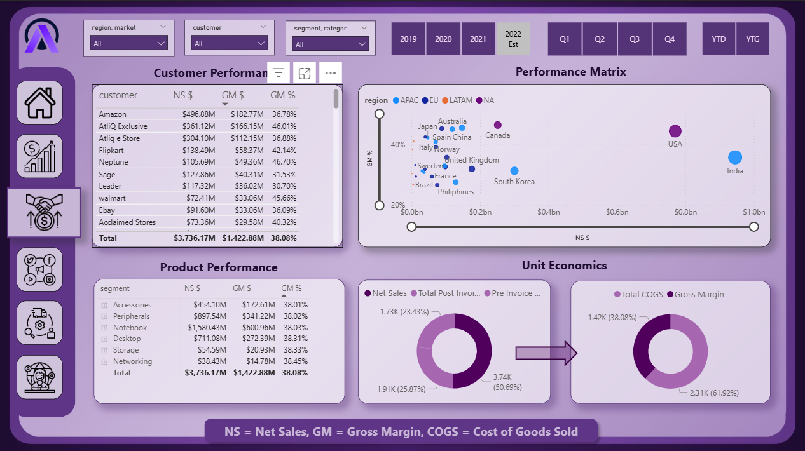
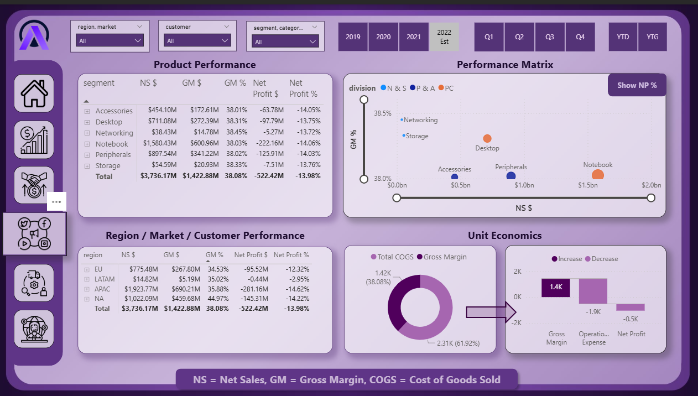
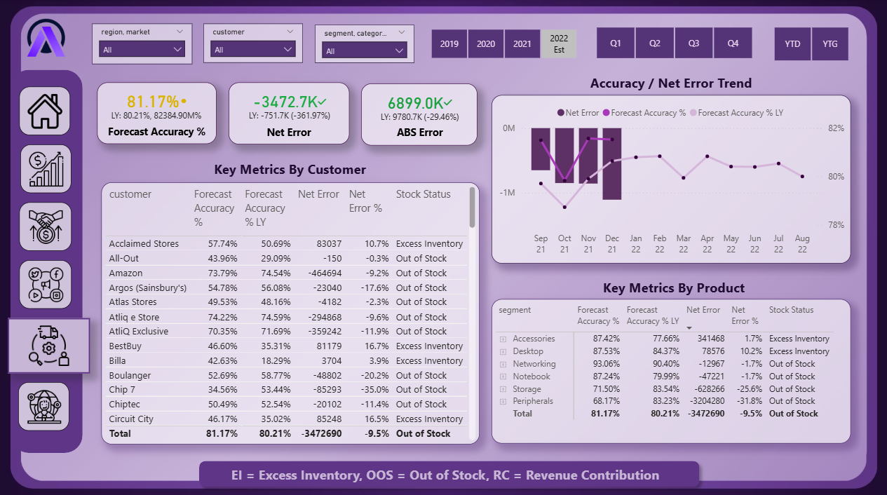
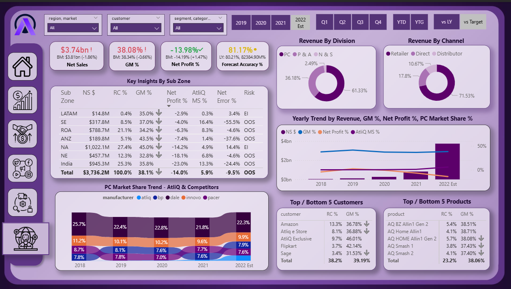

# AtliQ Business Insights 360 | Power BI

An end-to-end **Business Intelligence dashboard** built using **Power BI**, designed to provide a **360° view of business performance** across **Finance, Sales, Marketing, Supply Chain, and Executive leadership**.

This project simulates a **real-world enterprise BI environment**, focusing on **decision-making, KPI tracking, and cross-functional insights** rather than just visual reporting.

---

## 🔗 Project Links

* 📊 **Live Interactive Dashboard (Power BI Service):**
  [Dashboard](https://app.powerbi.com/view?r=eyJrIjoiMmExYmNhMTItYTE1Ny00MzY3LTk3NzUtMjVhZGIyMTJlY2E3IiwidCI6ImM2ZTU0OWIzLTVmNDUtNDAzMi1hYWU5LWQ0MjQ0ZGM1YjJjNCJ9&pageName=c681eb553d9650414aee)

* 📁 **Power BI File
Due to file size limitations, the PBIX file is hosted externally:**
[Download PBIX](https://drive.google.com/drive/folders/1pW22ynzSiLrg8tmMQnYrryhyOAILOOLN?usp=drive_link)

* 💼 **LinkedIn Profile:**
  [LinkedIn](https://www.linkedin.com/in/harsh-bajaj-data-analyst/)

---

## 🧩 Problem Statement

AtliQ operates across multiple regions, markets, products, and customers, generating large volumes of transactional and forecast data.
Leadership teams require **clear, consistent, and reliable insights** to monitor **sales performance, profitability, forecast accuracy, and operational risks** across the organization.

However, decision-makers often face challenges such as:

* Fragmented data across departments
* Difficulty comparing actual performance vs targets
* Limited visibility into profitability drivers and demand risks

The objective is to build a **centralized Business Intelligence solution** that consolidates data from multiple domains into a **single, executive-ready analytics platform**.

---

## 🎯 Task

You are a **Data Analyst** responsible for building a **Business Insights 360 dashboard** that enables stakeholders to:

* Monitor **Net Sales, Gross Margin, and Net Profit**
* Evaluate **forecast accuracy and inventory risks**
* Compare **performance across regions, customers, and products**
* Support **strategic and operational decision-making**

## Data Model

  

---

## Finance View

  

---

## Sales & Marketing View

  

---

## Sales & Marketing View

  

---

## Supply Chain View

  

---

## Executive View

  

---

## 🧭 Key Insights

* The business generates approximately **$3.74B in Net Sales**, with a **Gross Margin of ~38%**, indicating strong top-line performance but margin pressure at the net profit level.

* **Net Profit stands at -13.98%**, highlighting high operating and logistics costs that significantly impact profitability despite strong revenue.

* **Forecast Accuracy averages ~81%**, but certain customers and products contribute disproportionately to **net error and stock imbalance**, increasing inventory risk.

* **APAC and North America** contribute the highest sales volumes, while some regions generate strong revenue with comparatively lower margins, signaling pricing and cost optimization opportunities.

* A small subset of **top customers and products** drives a large share of revenue, increasing dependency risk and reinforcing the need for portfolio diversification.

---

## 📈 Business Impact

* Enables leadership to **compare actual performance vs benchmarks and targets** across time periods.

* Highlights **profit leakage** by linking sales growth with margin and cost behavior.

* Supports **inventory and demand planning** through forecast accuracy and net error tracking.

* Provides a **single source of truth** for Finance, Sales, Marketing, Supply Chain, and Executive teams.

---

## 🧠 Learnings from This Project

* Gained hands-on experience building **multi-page, cross-functional BI dashboards** aligned with real business roles.

* Improved understanding of **financial KPIs**, forecast metrics, and operational performance indicators.

* Learned how **data modeling and UX consistency** directly affect dashboard usability and stakeholder trust.

* Strengthened skills in **Power BI, DAX, Power Query, and business storytelling**.

---

